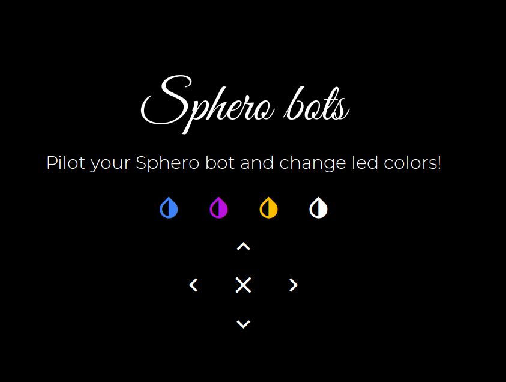

# Sphero bots



Pair your computer with a Sphero bot, note down the address and use it in index.js.

Avoid Windows if you have BLE pairing problems.

Commands:
```
# prepare
npm install
# start
node server.js
# if you have problems with noble install the module or check https://github.com/noble/noble if running without root/sudo
npm install noble
```

Pilot from web interface:
> http://localhost:3000/

